# Quai Multisig Wallet - Architecture Documentation

## Table of Contents

1. [System Overview](#system-overview)
2. [Smart Contract Architecture](#smart-contract-architecture)
3. [Proxy Pattern & Deployment](#proxy-pattern--deployment)
4. [Transaction Lifecycle](#transaction-lifecycle)
5. [Module System](#module-system)
6. [Frontend Architecture](#frontend-architecture)
7. [Security Model](#security-model)

---

## System Overview

High-level architecture showing all system components and their interactions.

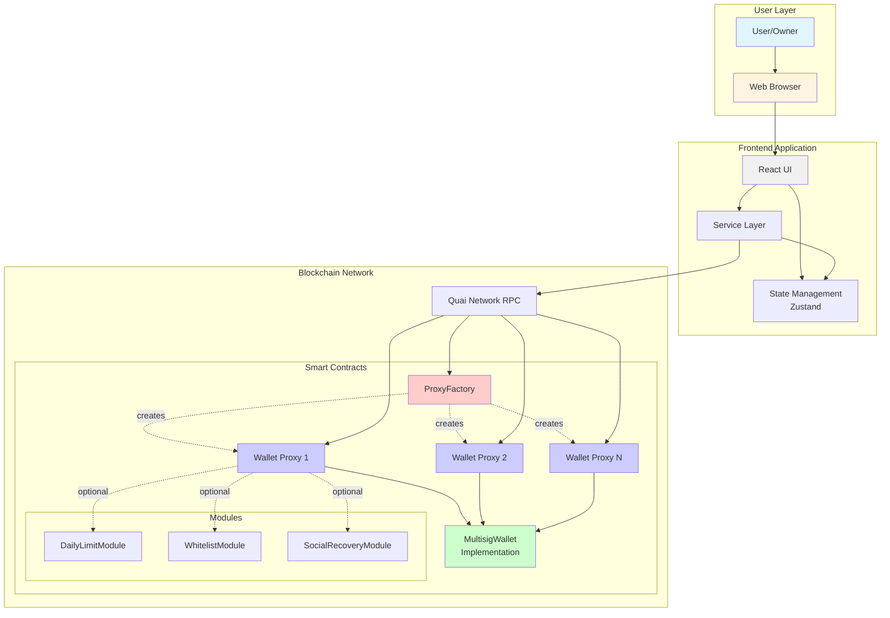

---

## Smart Contract Architecture

Detailed view of smart contract relationships and dependencies.

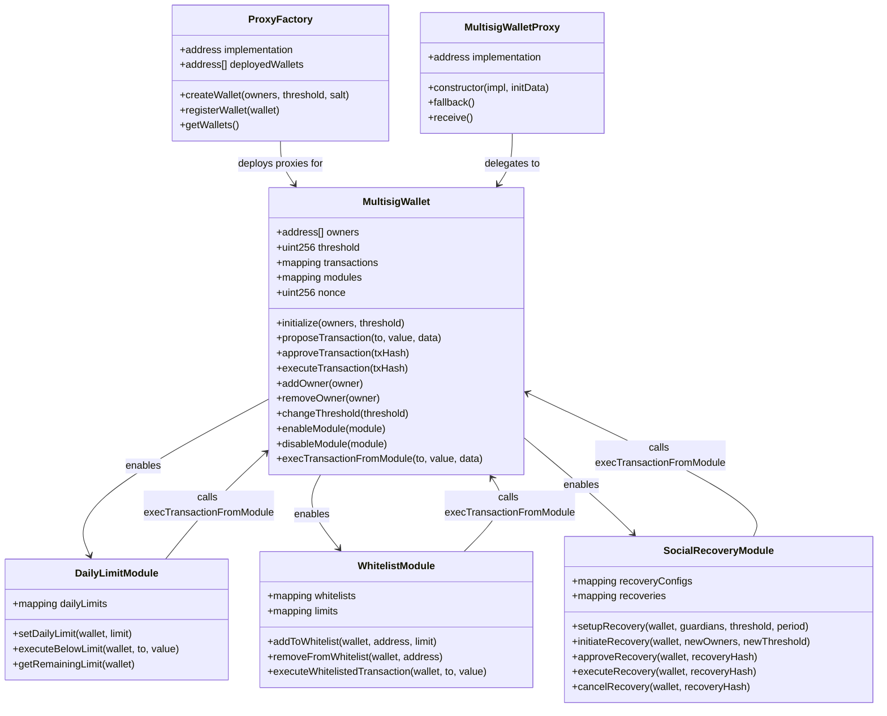

---

## Proxy Pattern & Deployment

How the proxy pattern works and the deployment process.

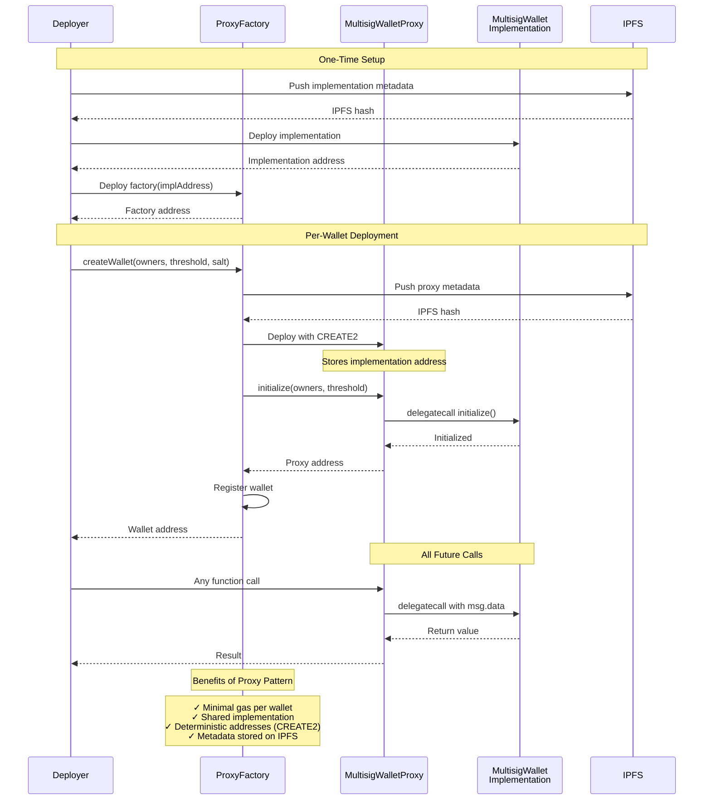

---

## Transaction Lifecycle

Complete flow of a multisig transaction from proposal to execution.

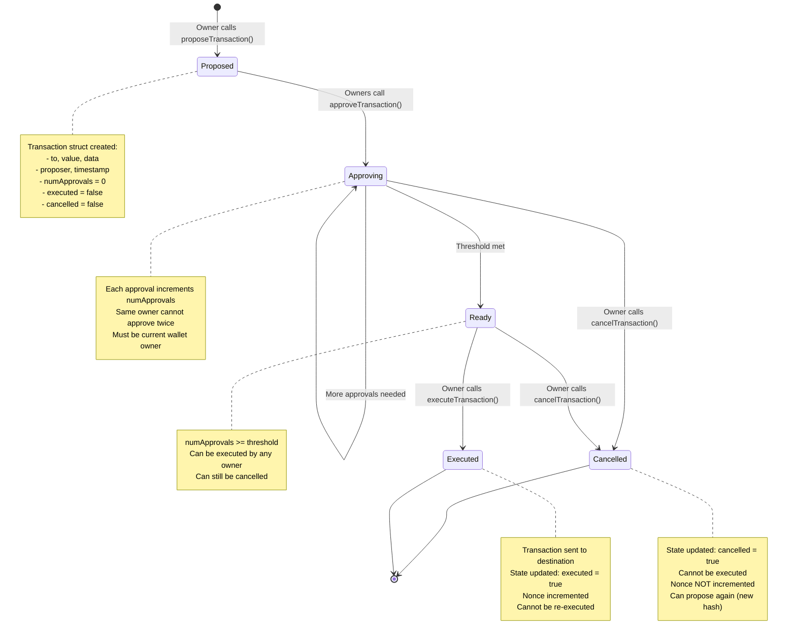

### Transaction Flow Sequence

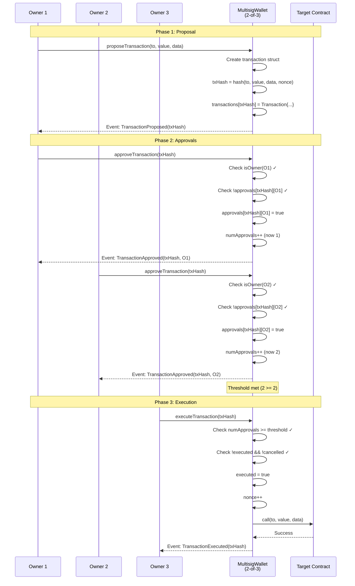

---

## Module System

How modules extend wallet functionality while maintaining security.

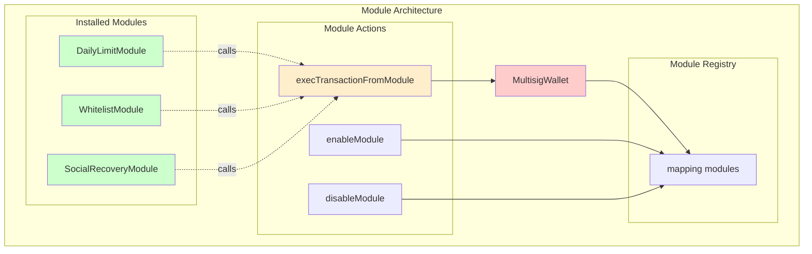

### Module Integration Flow

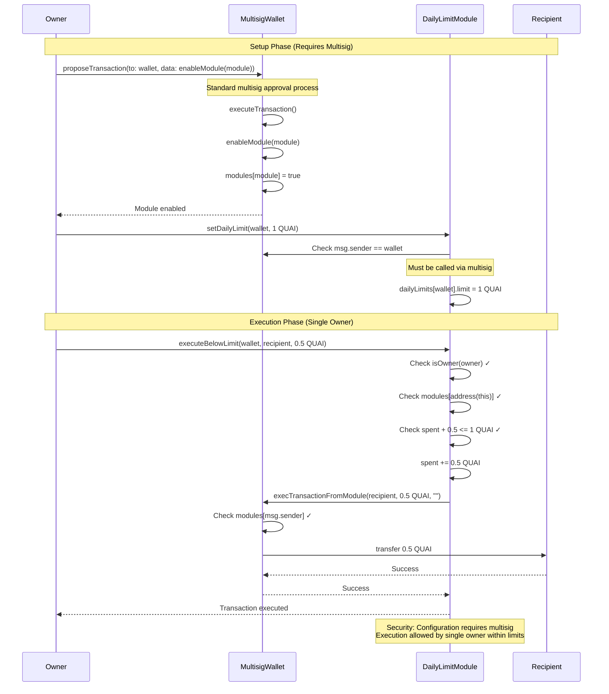

### Module Security Model

```mermaid
graph TB
    subgraph "Security Boundaries"
        subgraph "Requires Multisig Approval"
            Config1[Enable/Disable Module]
            Config2[Set Daily Limit]
            Config3[Add/Remove Whitelist]
            Config4[Configure Recovery]
        end

        subgraph "Single Owner Actions"
            Exec1[Execute Below Limit]
            Exec2[Execute to Whitelisted]
            Exec3[Approve Recovery<br/>as Guardian]
        end

        subgraph "Time-Delayed Actions"
            Delayed1[Execute Recovery<br/>after delay period]
        end

        subgraph "Module Restrictions"
            Restrict1[Cannot call enableModule]
            Restrict2[Cannot call disableModule]
            Restrict3[Cannot bypass owner checks]
        end
    end

    Config1 --> Wallet[MultisigWallet]
    Config2 --> Wallet
    Config3 --> Wallet
    Config4 --> Wallet

    Exec1 --> Limits[Check Limits]
    Exec2 --> Limits
    Exec3 --> Limits

    Limits --> Wallet

    Delayed1 --> Time[Check Time Elapsed]
    Time --> Wallet

    Restrict1 -.blocked.-> X1[X]
    Restrict2 -.blocked.-> X2[X]
    Restrict3 -.blocked.-> X3[X]

    style Config1 fill:#ffcccc
    style Config2 fill:#ffcccc
    style Config3 fill:#ffcccc
    style Config4 fill:#ffcccc
    style Exec1 fill:#ccffcc
    style Exec2 fill:#ccffcc
    style Exec3 fill:#ccffcc
    style Delayed1 fill:#ffffcc
```

---

## Frontend Architecture

Service layer architecture and state management.

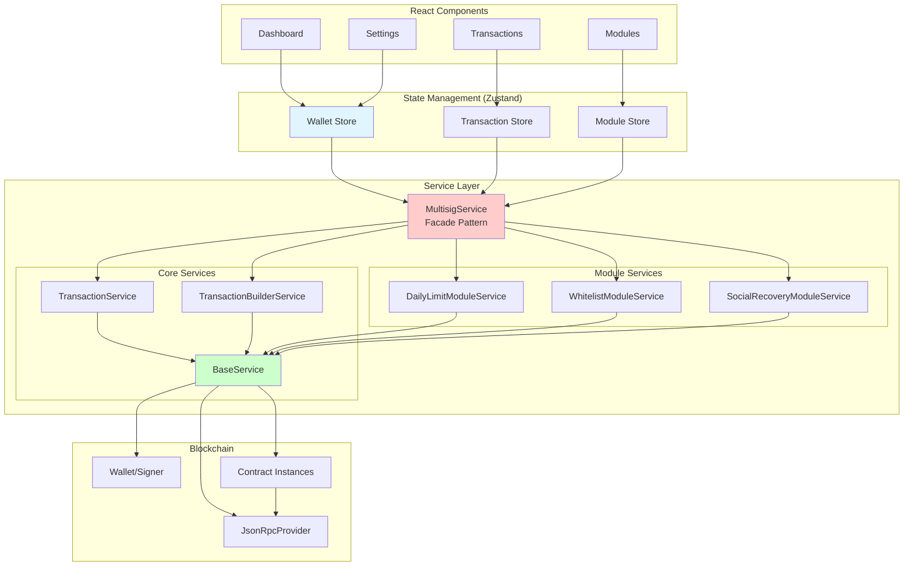

### Service Layer Pattern

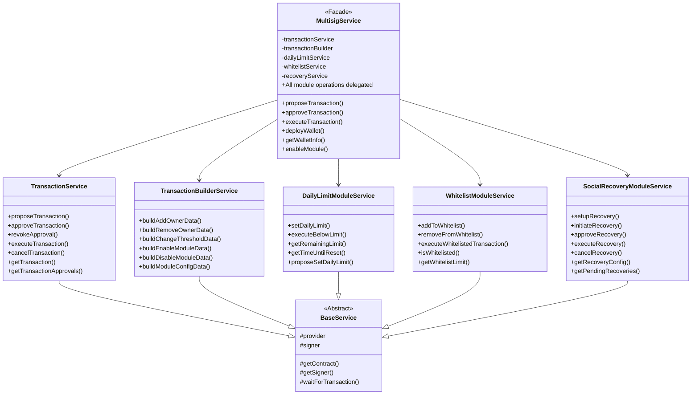

---

## Security Model

Multi-layered security architecture.

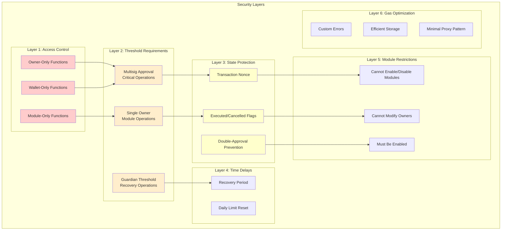

### Security Checks Flow

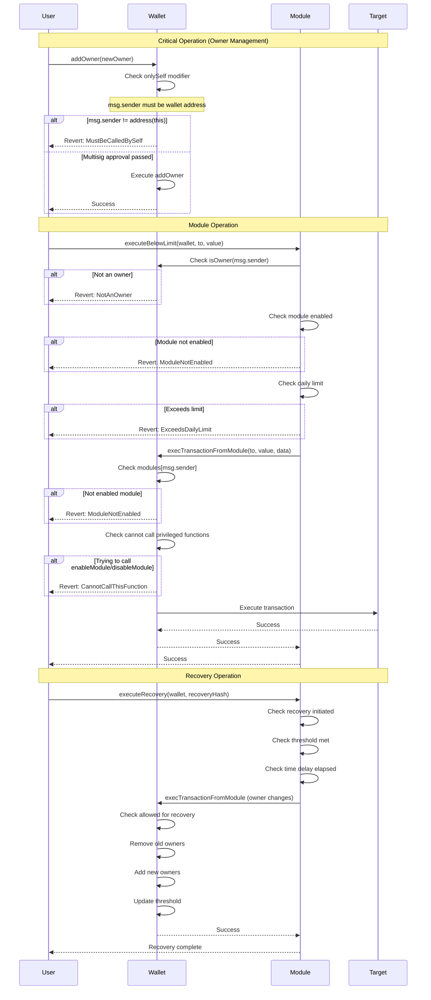

---

## Key Design Decisions

### 1. Proxy Pattern (EIP-1967)
- **Benefit**: Minimal gas cost per wallet (~100K gas vs 2M+ gas)
- **Trade-off**: All wallets share same implementation
- **Mitigation**: Rigorous testing and auditing of implementation

### 2. Nonce-Based Transaction Hashing
- **Benefit**: Allows duplicate transactions after cancellation
- **Trade-off**: Cannot predict transaction hash before nonce known
- **Mitigation**: Frontend queries nonce before proposal

### 3. Module System with execTransactionFromModule
- **Benefit**: Flexible extension without upgrading wallets
- **Trade-off**: Modules are trusted (must be enabled via multisig)
- **Mitigation**: Each module requires explicit multisig approval

### 4. Custom Errors Instead of Strings
- **Benefit**: ~50 gas savings per revert
- **Trade-off**: Slightly less readable in raw transactions
- **Mitigation**: Frontend decodes errors, tests check error types

### 5. Social Recovery with Time Delay
- **Benefit**: Protects against compromised guardians
- **Trade-off**: Recovery takes minimum 24 hours
- **Mitigation**: Owners can cancel recovery during delay period

### 6. Daily Limit Reset vs Sliding Window
- **Benefit**: Simpler implementation, lower gas
- **Trade-off**: Can spend 2x limit at boundary (11:59 PM + 12:01 AM)
- **Mitigation**: Document behavior, users set appropriate limits

---

## Technology Stack

### Smart Contracts
- **Language**: Solidity 0.8.20
- **Framework**: Hardhat
- **Testing**: Hardhat + Chai
- **Libraries**: OpenZeppelin Contracts 5.0.0
- **Network**: Quai Network

### Frontend
- **Framework**: React 18 + TypeScript
- **Build Tool**: Vite
- **State**: Zustand
- **Blockchain**: quais.js (Quai-specific ethers.js fork)
- **Styling**: TailwindCSS
- **Testing**: Vitest + React Testing Library

### Development Tools
- **Linting**: ESLint + Solhint
- **Formatting**: Prettier
- **Type Generation**: TypeChain
- **Coverage**: Solidity Coverage
- **Gas Reporting**: Hardhat Gas Reporter

---

## Deployment Addresses

Contract addresses are managed in:
- **Root**: `.env` (for deployment scripts)
- **Frontend**: `frontend/.env` (with `VITE_` prefix)
- **Deployment Records**: `contracts/deployments/` (JSON files)

Key environment variables:
```bash
# Implementation and factory
MULTISIG_IMPLEMENTATION=0x...
PROXY_FACTORY=0x...

# Modules
SOCIAL_RECOVERY_MODULE=0x...
DAILY_LIMIT_MODULE=0x...
WHITELIST_MODULE=0x...

# Network
RPC_URL=https://rpc.cyprus1.orchard.quai.network
BLOCK_EXPLORER_URL=https://quaiscan.io
```

---

*Generated: 2026-01-29*
